# Kurumsal Çözümler (Enterprise Solutions) için Java

Kurumsal projeleri düşündüğümüzde hepsinin belli başlı temel ve aynı zamanda ortak ihtiyaçları olduğunu görürüz. Veri saklama *(Persistence)*, güvenlik *(Security)*, web servisleri *(Web Services)*, transaction yönetimi, gevşek bağlı yapılar *(Loose Coupling)* vb Bu değişmeyen ihtiyaçlarda soyutlamaların *(Abstraction)* standartlaştırılması da önemlidir. Asıl implementasyon detayları bu soyutlamaların üzerinde şekillenir. Ana prensip olarak Java Enterprise Edition (Java EE) veya Jakarta EE gibi çatılar bu soyutlamaları standartlaştırmak için ortaya çıkmıştır.

Bu noktada bazı temel kavramları bilmekte yarar var.

## Application Server

Örneğin uygulama sunucları *(Application Server)* kurumsal çözümlerin önemli bir parçasıdır. Loglama, hata yönetimi, REST uç noktaları, JSON standartları, CDI *(Contexts and Dependency Injection)*, JPA *(Java Persistence API)*, JMS *(Java Message Service)*, EJB *(Enterprise Java Beans)* gibi kurumsal çözümlerde sıkça ihtiyaç duyulan soyutlamaları standartlaştırırlar. Bu sayede geliştiriciler uygulama sunucusunun sağladığı standartları kullanarak iş mantığını geliştirmeye odaklanabilirler. Bazı popüler uygulama sunucuları şunlardır:

- [IBM Open Liberty](https://openliberty.io/)
- [Payara Server *(Glassfish)*](https://www.payara.fish/)
- [JBOSS Wildfly](https://www.wildfly.org/)

Bu sunucular bir nevi Java EE spesifikasyonlarının asıl implementasyonları *(Concrete Implementations)* olarak düşünülebilir. Örneğin Jakarta EE 11 spesifikasyonları için Open Liberty, Payara Server ve Wildfly gibi uygulama sunucuları asıl implementasyonları sağlarlar.

## JSR *(Java Specification Request)*

JSR, Java topluluğu tarafından önerilen ve Java platformuna eklenmesi düşünülen yeni özellikleri veya mevcut özelliklerde yapılacak değişiklikleri tanımlayan bir belgedir. Her JSR, belirli bir Java teknolojisi veya API için bir spesifikasyon sunar ve bu spesifikasyonlar, uygulama sunucuları tarafından implemente edilir. Örneğin [CDI 1.0 için JSR-299](https://jcp.org/ja/jsr/detail?id=299), [JPA 2.0 için JSR-317](https://jcp.org/ja/jsr/detail?id=317) gibi

## Reference Implementation *(RI)*

Özet JSR'ların *(Abstract Specifications)* asıl implementasyonlarıdır. Örneğin JAX-RS için referans implementasyon olarak [Jersey](https://eclipse-ee4j.github.io/jersey/) kullanılabilir. Hatta Java EE'ın kendisi aslında bir JSR *(Java Specification Request)* olarak düşünülebilir. Java EE 8 sürümü [JSR 366](https://jcp.org/en/jsr/detail?id=366) olarak tanımlanmıştır ve Glassfish bu JSR'ın örnek bir implementasyonudur *(RI - Reference Implementation)*.

## Jakarta EE

[Jakarta EE](https://jakarta.ee/) Java EE'ın evrimleşmiş bir versiyonu olarak düşünülebilir. Oracle'ın Java EE'yi Eclipse Foundation'a devretmesiyle birlikte, Java EE artık Jakarta EE olarak adlandırılmaktadır. Jakarta EE, Java EE'ın tüm özelliklerini ve API'lerini içerir, ancak isimlendirme ve bazı paket değişiklikleri ile güncellenmiştir. Örneğin, `javax.*` paketleri artık `jakarta.*` olarak değişmiştir.

Java ekosisteminin en önemli özelliklerinden birisi standartlar *(specifications)* ve implementasyonların *(implementations)* birbirinden kesin çizgilerle ayrılmasıdır. Alışkın olduğumuz mimarilerde genellikle ilkeleri belirleyen ve işi yapan aynı framework altında toplanır. Jakart ise sadece kuralları ve arayüzleri belirler, iş topluluk tarafından geliştirilen motorların üstünden yürütülür. Burada karşımıza üç ana bileşenin çıktığını görürüz. CDI *(Contexts and Dependency Injection)*, JPA *(Java Persistence API)* ve JAX-RS *(Java API for RESTful Web Services)*.

### CDI *(Contexts and Dependency Injection)*

Uygulamanın sinir sistemi olarak ifade edildiği sıklıkla görülür. Nesnelerin yaşam döngülerini ve birbirlerine olan bağımlılıklarını yönetir. Sonradan .NET tarafına gelen Microsoft.Extensions.DependencyInjection kütüphanesi olarak düşünebiliriz ya da Autofac, Ninject gibi dependency injection kütüphanelerine benzetebiliriz. Diğer yandan bunu basit bir DI aracı olarak görmemek lazım. Kendi için olay yönetimi (Event/Observer) sunar. Ayrıca interceptor yapısı ile metodan girmeden önce veya çıktıktan sonra araya girip AOP *(Aspect Oriented Programming)* tarzı davranışlar sergileyebilir. Örneğin bir metodun girişinde loglama yapmak, yetkilendirme kontrolü icra ettirmek otomatik transaction işletmek gibi.

### JPA *(Java Persistence API)*

Uygulamanın hafızası olarak düşünebiliriz. Temelde bir arayüz ve anotasyonlar kümesidir. `@Entity`, `@Table`, `@Column` gibi anotasyonlar ile nesneleri veritabanı tablolarına eşler. Kendi başına sorgu atmaz. Bunun için JPA implementasyonları vardır. Örneğin Hibernate, EclipseLink, OpenJPA gibi. Bu implementasyonlar JPA'nın sağladığı arayüzleri kullanarak veritabanı ile iletişim kurar ve sorguları işler. Kavramsal olarak .NET tarafındaki Entity Framework veya Dapper gibi ORM *(Object-Relational Mapping)* kütüphanelerine benzetebiliriz. Hatta DbContext ve DbSet ile kurulan yap burada EntityManager üzerinden yürütülür.

### JAX-RS *(Java API for RESTful Web Services)*

Uygulamanın dış dünyaya açılan kapısı olarak düşünebiliriz. RESTful web servisleri oluşturmak için standart bir API sunar. `@Path`, `@GET`, `@POST`, `@PUT`, `@DELETE` gibi anotasyonlar ile HTTP isteklerini işleyen metodları tanımlar. .NET tarafındaki Route, HttGet gibi nitelikler burada `@Path`, `@Get` gibi anotasyonlarla karşılık bulur.

> Bu üç standard düzgün bir şekilde bir araya getirildiğinde uygulama sunucusundan bağımsız, taşınabilir ve tertemiz bir mimari elde etmiş oluruz.

## Alet Çantası

Nelere ihtiyacımız var?

- JDK *(Java Development Kit)*
- [NetBeans IDE](https://netbeans.apache.org/front/main/index.html), [Eclipse IDE](https://www.eclipse.org/downloads/) veya [Visual Studio Code](https://code.visualstudio.com/) gibi kod geliştirme aracı.
- [Insomnia](https://insomnia.rest/) veya [Postman](https://www.postman.com/) gibi REST API test araçları.
- [Apache Maven](https://maven.apache.org/) veya [Gradle](https://gradle.org/) gibi proje yönetim ve derleme araçları.
- [Payara Micro Server](https://payara.fish/products/payara-micro/) Micro service suncusu olarak kullanabiliriz. Hafifsiklet bir web sunucusu olarak düşünebiliriz. .NET Core ile hayatımıza giren Kestrel web sunucusuna benzetebiliriz. Özünde Payara Micro, Jakarta EE spesifikasyonlarını implement eden bir uygulama sunucusudur ve özellikle mikro servis mimarileri için tercih edilir.

Kendi Ubuntu sistemimde `Insomnia` kurulumunda sorun çıktı. Aşağıdaki şekilde kurabildim.

```bash
wget --content-disposition https://updates.insomnia.rest/downloads/ubuntu/latest
sudo apt install ./Insomnia*.deb
```

Benzer şekilde `Payara Micro` sunucusunu çalıştırırken de IPv6 ile ilgili bir hata aldım. Burada IPv4 kullanmaya zorlamak için aşağıdaki komutu kullanabiliriz.

```bash
# Payara Micro 7.2026.5.jar içeriğini indirdiğim klasörde çalıştırıyorum.
java -Djava.net.preferIPv4Stack=true -jar payara-micro-7.2026.5.jar
# Sonrasında 8080 portu üzerinden sunucuya erişebilirsiniz.
```

> `Djava.net.preferIPv4Stack=true` parametresi JVM'e IPv4 protokolünü tercih etmesini söyler. Java çalışma zamanı Linux ortamlarında bazen ısrarla IPv6 kullanmaya çalışır. Özellikle ortam sadece IPv4'e göre ayarlanmışsa ya da sadece onu destekliyorsa, uygulama portu dinleyemez ve BindException gibi hatalar fırlatır. Ya da PostgreSQL gibi servislerle iletişim kurarken Timeout hataları alınır. Bu parametre ile JVM'e IPv4 kullanmasını zorunlu kılarak hataların önüne geçebiliriz.

## Hello World Uygulaması

Macera Jakarta öncesi dönemden EE 8 uyumlu bir proje ile başlıyor. Bu projeyi oluşturmak için NetBeans IDE kullanabiliriz. NetBeans IDE'yi açtıktan sonra aşağıdaki adımları takip edebiliriz.

- Adım 1 Proje seçimi: File -> New Project -> Java with Maven -> Project from Archetype -> Next
- Adım 2 Archetype seçimi: `jakarta.jakartaee-api` seçimi -> Next
- Adım 3 Proje bilgileri: Project Name : `hello-world`, Group Id olarak `lecture.java` verip projeyi oluşturabiliriz.

`HelloResources.java` içeriğini olduğu gibi bırakabiliriz.

```java
package jp.coppermine.ping;

import jakarta.enterprise.context.RequestScoped;
import jakarta.ws.rs.GET;
import jakarta.ws.rs.Path;

/**
 * Sample JAX-RS resources.
 *
 */
@Path("hello")
@RequestScoped
public class HelloResource {
    
    @GET
    public String getMessage() {
        return "Hello, world";
    }
    
}
```

Sonrasında projeye sağ tıklayıp `Clean and Build` ile temiz bir derleme başlatalım. Bu işlem sonraında projenin `target` isimli klasöründe `hello-world.war` isimli bir dosya oluşacaktır *(WAR' ın açılımı Web Application Resource ya da Web application ARchive)*. Bu dosya web uygulamasının paketlenmiş halidir. Bunu bir web sunucusuna deploy ederek çalıştırabiliriz. Örneğin Payara Micro sunucusu üzerinde.

Kendi ubuntu sistemimde şöyle hareket ettim; Payara Micro sunucusu indirdiğim klasörde `wars` isimli bir alt klasör açtım ve projenin derlenmiş `hello-world.war` dosyasını buraya kopyaladım. Root klasörde ise aşağıdaki komutu işlettim.

```bash
java -Djava.net.preferIPv4Stack=true -jar payara-micro-7.2026.5.jar --deploy wars/hello-world.war
```

Bu komut `hello-world.war` dosyasını deploy ederek sunucuyu başlatacaktır. Sonrasında `http://localhost:8080/hello-world/api/hello` adresine gittiğimizde tarayıcıda aşağıdaki çıktıyı görebiliriz.


## Bir Diğer Örnek (Tam Jakarta Uyumlu)

NetBeans tarafında projeyi oluştururken Web Application türünü seçip ilerledim.

| **Alan** | **Değer** |
| --- | --- |
| **Project Name** | games-api |
| **Group Id** | com.lectures.java.games |
| **Artifact Id** | games-api |
| **Version** | 1.0-SNAPSHOT |
| **Archetype** | `jakarta.jakartaee-api` |
| **Build Final Name** | games-world |

pom.xml;

```xml
<project xmlns="http://maven.apache.org/POM/4.0.0" xmlns:xsi="http://www.w3.org/2001/XMLSchema-instance"
         xsi:schemaLocation="http://maven.apache.org/POM/4.0.0 http://maven.apache.org/xsd/maven-4.0.0.xsd">
    <modelVersion>4.0.0</modelVersion>
    <groupId>com.lectures.java.games</groupId>
    <artifactId>games-api</artifactId>
    <version>1.0-SNAPSHOT</version>
    <packaging>war</packaging>
    <name>games-api-1.0-SNAPSHOT</name>
    
    <properties>
        <project.build.sourceEncoding>UTF-8</project.build.sourceEncoding>
        <jakartaee>11.0.0-M1</jakartaee>
    </properties>
    
    <dependencies>
        <dependency>
            <groupId>jakarta.platform</groupId>
            <artifactId>jakarta.jakartaee-api</artifactId>
            <version>${jakartaee}</version>
            <scope>provided</scope>
        </dependency>
    </dependencies>
    
    <build>
        <finalName>games-world</finalName>
        <plugins>
            <plugin>
                <groupId>org.apache.maven.plugins</groupId>
                <artifactId>maven-compiler-plugin</artifactId>
                <version>3.12.1</version>
                <configuration>
                    <source>17</source>
                    <target>17</target>
                </configuration>
            </plugin>
            <plugin>
                <groupId>org.apache.maven.plugins</groupId>
                <artifactId>maven-war-plugin</artifactId>
                <version>3.4.0</version>
            </plugin>
        </plugins>
    </build>
</project>
```

Proje çok basit olarak **in-memory** bir koleksiyonda tutulan bilgisayar oyun bilgilerini döndüren bir REST API sunuyor. Tabii öncelikle projenin temiz bir şekilde build olması gerekiyor. Sonrasında `target` klasöründe oluşan `games-api.war` dosyasını Payara Micro klasöründeki `wars` alt klasörüne kopyalayıp aşağıdaki komutu çalıştırabiliriz.

```bash
java -Djava.net.preferIPv4Stack=true -jar payara-micro-7.2026.5.jar --deploy wars/games-world.war

# Basit bir CURL komutu ile test
curl http://localhost:8080/games-world/api/games
```

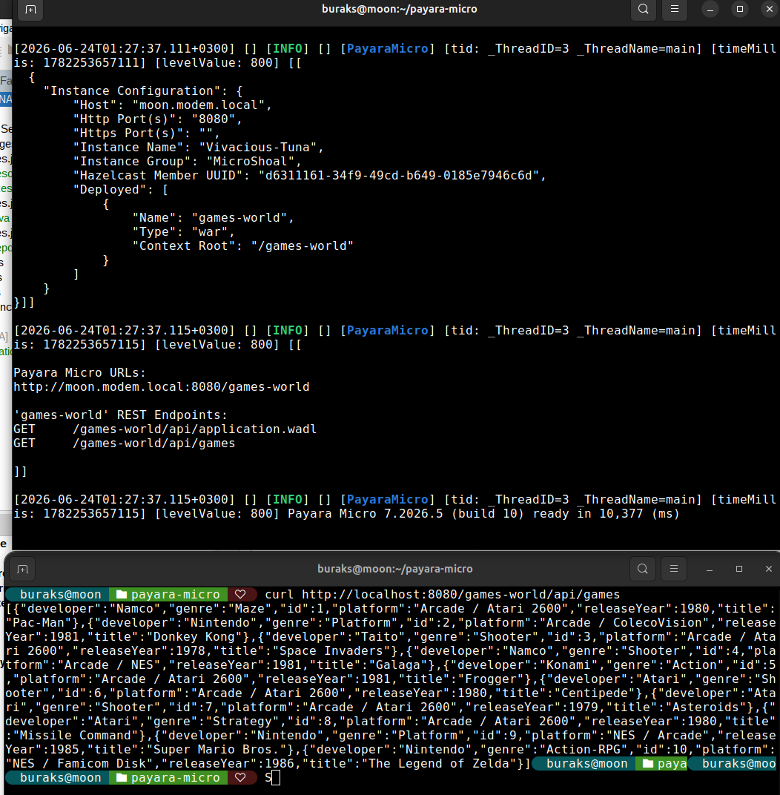

## Todo API (Daha iyi bir başlangıç)

Bu giriş seviyesindeki REST servis örneğinde jakarta'nın CDI *(Contexts and Dependency Injection)* ve JPA *(Java Persistence API)* özelliklerini tam anlamıyla görme şansımız oluyor. Bu seferki örneğimiz Todo işlemleri için yine docker container olarak çalışan PostgreSQL veritabanına bağlanıyor.

```bash
# WAR dosyası oluştuktan sonra önceki örnekte olduğu gibi Payara Micro sunucusuna deploy edebiliriz.
java -Djava.net.preferIPv4Stack=true -jar payara-micro-7.2026.5.jar --deploy wars/todo-app.war
```

Genel olarak aşağıdaki kavramları ele aldık;

- **CDI Bağımlılık Enjeksiyonu:** `@Inject` anotasyonu ile bileşenler arasında gevşek bağlılık *(Loosely Coupled)* sağlanır. TodoService ve Event gibi bileşenler otomatik olarak uygun yerlere enjekte edilir.
- **JAX-RS REST Endpointleri:** HTTP metodları (GET, POST, PUT, DELETE) ve URL yolları (`@Path`) aracılığıyla REST servisleri tanımlanır. Request ve response veriler JSON formatında işlenir.
- **JPA Entity'leri:** Veritabanı tabloları nesne-yönelimli bir şekilde temsil edilir. Todo Entity ORM aracılığıyla PostgreSQL'e eşleştirilir.
- **CDI Event Gözleme (Observer Pattern):** TodoCreatedEvent fırlatıldığında, TodoNotificationObserver otomatik olarak ayağa kaldırılır ve event'i işler. Sistem bileşenleri arasında düşük bağımlılıklı *(Loosely Coupled)* haberleşme sağlanır.
- **CDI Interceptor'lar:** LogExecutionTime anotasyonu kullanılan metodlar Aspect Oriented yaklaşımı ile çevrelenir ve çalışma süresi otomatik olarak ölçülür. Cross-cutting concerns implementasyonunun temiz bir uygulanış biçimidir.
- **Asenkron İşlemler:** JAX-RS async desteği (`@Suspended`, AsyncResponse, CompletableFuture) ve ManagedExecutorService ile uzun süreli *(long-running)* operasyonlar bloklanmadan *(non-blocking)* gerçekleştirilir. ManagedExecutorService, Jakarta EE container tarafından yönetilen bir thread havuzudur ve uygulama sunucusunun *(Payara gibi)* context'e erişip thread yönetimini üstlenmesini sağlar.

### Pom *(Project Object Model)* İçeriği Hakkında

Jakarta için giriş niteliğindeki bu proje tipik olarak JPA, CDI ve JAX-RS yapılarının en temel halini kullanıyor. POM dosyası içeriğine göre söyleyebileceğimiz birçok şey var. Önce içeriğe bakalım.

```xml
<project xmlns="http://maven.apache.org/POM/4.0.0" xmlns:xsi="http://www.w3.org/2001/XMLSchema-instance"
         xsi:schemaLocation="http://maven.apache.org/POM/4.0.0 http://maven.apache.org/xsd/maven-4.0.0.xsd">
    <modelVersion>4.0.0</modelVersion>
    <groupId>com.lectures</groupId>
    <artifactId>todo-app</artifactId>
    <version>1.0-SNAPSHOT</version>
    <packaging>war</packaging>
    <name>todo-app-1.0-SNAPSHOT</name>
    
    <properties>
        <project.build.sourceEncoding>UTF-8</project.build.sourceEncoding>
        <jakartaee>11.0.0-M1</jakartaee>
    </properties>
    
    <dependencies>
        <dependency>
            <groupId>jakarta.platform</groupId>
            <artifactId>jakarta.jakartaee-api</artifactId>
            <version>${jakartaee}</version>
            <scope>provided</scope>
        </dependency>
        <dependency>
            <groupId>org.postgresql</groupId>
            <artifactId>postgresql</artifactId>
            <version>42.7.3</version>
        </dependency>
    </dependencies>
    
    <build>
         <finalName>todo-app</finalName>
        <plugins>
            <plugin>
                <groupId>org.apache.maven.plugins</groupId>
                <artifactId>maven-compiler-plugin</artifactId>
                <version>3.12.1</version>
                <configuration>
                    <source>21</source>
                    <target>21</target>
                </configuration>
            </plugin>
            <plugin>
                <groupId>org.apache.maven.plugins</groupId>
                <artifactId>maven-war-plugin</artifactId>
                <version>3.4.0</version>
            </plugin>
        </plugins>
    </build>
</project>
```

- **`jakarta.jakartaee-api` için scoped bildirimi:** Maven'a sadece Jakarta EE arayüzlerini kullanacağımızı ve uygulama sunucusunun bu arayüzlerin implementasyonlarını sağlayacağını söylüyoruz. Kodun derlenmesi için bu arayüzler gerekli ancak derlenmiş çıktıya dahil edilmeyecekler *(yani WAR dosyasına)* Zira uygulamanın çalıştırılacağı sunucu *(ki burada Payara Micro'yu kullandık)* gerekli motorları *(Hibernate, RESTEasy, Weld vb)* bize çalışma zamanında sağlayacak. Bu yaklaşıma göre WAR dosyası sadee yazdığımı iş mantığını *(business logic)* barındıracaktır ve boyut olarak da çok küçük kalacaktır. Oldukça temiz ve izole bir mimari elde ediyoruz diyebilirim.
- **`postgresql` bağımlılığı:** JDBC sürücüsü olarak PostgreSQL veritabanına bağlanmak için `org.postgresql` isimli bağımlılığı ekledik. Bu sürücü, JPA implementasyonunu yapmaktadır ve veritabanı ile iletişim kurmamızı sağlar. Önceki maddede belirttiğimiz üzere bu bağımlılık **scoped** olarak belirtilmediği için WAR dosyasına dahil edilir. Bu sayede uygulama sunucusu çalıştırıldığında gerekli sürücü de WAR dosyası ile birlikte yüklenir. Uygulama sunucusunda bu sürücü mevcut olmasa bile uygulama çalışır. Burada scoped olma ve olmama halini betimlemek için de kullandık. Bu arada veritabanı bağlantı ayarlarımız `src/main/resources/META-INF/persistence.xml` dosyasında yer alıyor. Bu dosya JPA'nın konfigürasyon dosyasıdır.
- **Jakarta EE 11.0.0-M1 sürümü:** Projeyi yazdığım tarih itibariyle kullanılan sürüm. Jakarta EE 11'in ilk milestone sürümü. Bu sürümde JPA 3.1, CDI 4.0, JAX-RS 3.1 gibi yeni versiyonlar yer alıyor.
- **Java 21 sürümü:** Projeyi yazdığım tarih itibariyle kullanılan Java sürümü. Normalde makinede Java 25 yüklü ancak Payara Micro 7.2026.5 sürümünün Java 21 ile uyumlu olduğu yazıyordu. Bu nedenle derleme ve çalıştırma için Java 21 kullanıyoruz.

### Todo API için Testler

Örnek HTTP taleplerini Insomnia ile çalıştırabiliriz. [Yaml formatındaki Insomnia çıktısı şurada](Insomnia_TodoApi.yaml) Yani bu dosyayı Insomnia'ya import ederek testleri kolayca yapabilirsiniz.

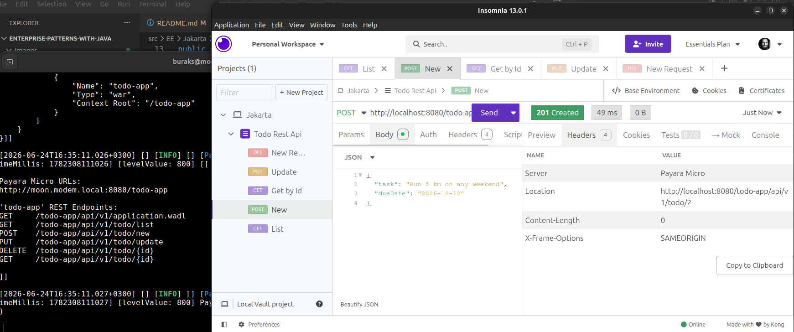

Insomnia ile de test edebileceğimiz HTTP taleplerini terminalden curl komutu ile de işletebiliriz. Burada `localhost:8080` adresi Payara Micro sunucusunun çalıştığı adres ve porttur.

```bash
# 1. Tüm Todo'ları Listele (GET)
curl -X GET "http://localhost:8080/todo-app/api/v1/todo/list"

# 2. Yeni Todo Oluştur (POST)

curl -X POST "http://localhost:8080/todo-app/api/v1/todo/new" \
  -H "Content-Type: application/json" \
  -d '{
    "task": "Walk 15 km on any weekend",
    "dueDate": "2026-12-12"
  }'

# 3. ID'ye Göre Todo Getir (GET)
curl -X GET "http://localhost:8080/todo-app/api/v1/todo/1"

# 4. Todo'yu Güncelle (PUT)
curl -X PUT "http://localhost:8080/todo-app/api/v1/todo/update" \
  -H "Content-Type: application/json" \
  -d '{
    "id": 1,
    "isCompleted": true
  }'

# 5. Todo'yu Sil (DELETE)
curl -X DELETE "http://localhost:8080/todo-app/api/v1/todo/1"

# 6. Todo'yu Tamamlandı Olarak İşaretle (POST)
curl -X POST "http://localhost:8080/todo-app/api/v1/todo/status?id=2"
```

## CDI-Concept Örneği

CDI *(Contexts and Dependency Injection)* kavramını daha iyi anlamak için **cdi-concept** isimli örnek projeyi inceleyebiliriz. Örnek uygulamada aynı arayüzden *(interface)* türeyen iki farklı ödeme yöntemi bileşeninin bir **Qualifier** yardımıyla DI tarafından nasıl çözümlendiği ele alınıyor. Bir arayüzden *(interface)* türeyen farklı implementasyonlar olduğunda CDI, hangi implementasyonun enjekte edileceğini anlamak için Qualifier anotasyonunu kullanır.

> .NET tarafından düşünecek olursak 8nci sürüme kadar factory deseni ile çözdüğümüz, 8 ve sonrasında ise **Keyed Service** kavramı ile üstesinden geldiğimiz duruma benzer. Ancak Java tarafında en başından beri Qualifier anotasyonu ile bu durum çözülmüş.

Örnek uygulamada `CreditCardProcessor` ve `CryptoProcessor` isimli iki farklı ödeme yöntemi bileşeni var. Bu iki bileşen aynı arayüzü implement ediyor ve kullanılan yerlere enjekte ediliyorlar. Özellikle dikkat edelim, **CryptoProcessor** bileşeni `@Crypto` isimli anotasyon ile işaretlenmiş halde. Buna göre asıl servise enjekte edilen bileşen de `@Crypto` anotasyonu ile işaretlenmişse **CryptoProcessor** olarak davranacaktır. Diğer durumdaysa **CreditCardProcessor** ele alınır. Kodlara bakınca durumu daha iyi anlayabiliriz.

Örnek uygulamayı çalıştırmak için önce `cdi-concept.war` dosyasını oluşturup Payara Micro sunucusuna deploy etmemiz gerekiyor.

```bash
# cdi-concept.war dosyasını oluşturmak için önce projeyi derleyelim.
mvn clean package

# Sonrasında Payara Micro sunucusuna deploy edelim.
java -Djava.net.preferIPv4Stack=true -jar payara-micro-7.2026.5.jar --deploy wars/cdi-concept.war
```

Yine Insomnia veya curl komutları ile sonuçları test edebiliriz. CreditCardProcessor bileşeni her talepte bir kez oluşturulur. Ancak CryptoProcessor bileşeni uygulama seviyesinde bir kez oluşturulur. Bu `@RequestScoped` ve `@ApplicationScoped` anotasyonları kullanılması halinde CDI' ın nasıl davrandığını da gösterir.

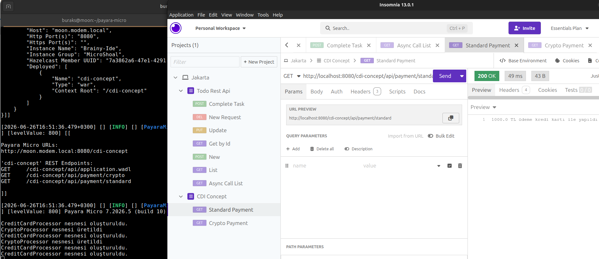

Bu arada servis bileşenine enjekte edilen bileşenler için herhangi bir merkezi konumda Scope belirterek bir tanımlama yapmadığımıza dikkat edelim. CDI anotasyonları ile her bileşenin kendi yaşam döngüsü *(Lifecycle)* ve kapsamı *(Scope)* belirlenir ve DI tarafına bildirilir. .NET tarafında genellikle DI servislerine açık bir şekilde bu bildirimlerin yapılması gerekir.

## Figures Api *(Event Kullanımı Örneği)*

Bu örnekte kahramanımız çizgi karakter figürleri ile ilgili stok yönetimi yapan bir servis. Pek tabii tüm domain'i ele almıyor. Sadece bir JAX-RS uyarlamasında stoğa yeni bir figüre geldiğinde dış dünyaya *(ki bu senaryoda Rabbit MQ)* bir event fırlatıyor. Jakarta türevli uygulama CDI tabanlı ve yine Payara Platformu üzerinden çalışmakta. Amaç kurumsal çözümlerde önemli kavramlardan birisi olan domain ile ilgili değişikliklerde dış sistemleri bilgilendirmek için kullanılan event tabanlı haberleşme *(Event Driven Communication)* kavramını göstermek. Bİzim senaryomuzda Rabbit MQ kullanılıyor. Ayrıca loglama için de [OpenObserve](https://github.com/openobserve/openobserve) isimli bir ürün kullanılıyor. Tüm bu servisler docker container olarak işletilmekte. *([docker-compose](docker-compose.yml) dosyasının son haline bakınız)*

Uygulamanın bağımlılıkları arasında rabbitmq-client ve OpenObserve için gerekli kütüphaneler yer almakta. Bu bağımlılıklar da `pom.xml` dosyasında yer almakta. Loglama alt yapısında **Simple Logging Facade for Java (SLF4J)** kullanılıyor. [SLF4J](https://github.com/qos-ch/slf4j), farklı loglama framework'lerini soyutlayan bir arayüz sağlar. Bu sayede uygulama kodu loglama framework'ünden bağımsız olur ve farklı loglama implementasyonları kolayca değiştirilebilir. Örnekte sdk türevi kullanılıyor. Buna göre loglama çağrıları `java.util.logging` kütüphanesine bağlanır. Payara kendi loglama altyapısını JUL *(Java Util Logging)* üzerine kurmuştur. Bu sayede loglama çağrıları Payara'nın loglama altyapısına yönlendirilir ve loglar konsola veya dosyaya yazdırılabilir.

### Annotated Modu

Projenin `WEB-INF` altında yer alan `beans.xml` dosyasında `bean-discovery-mode` özelliği **annotated** olarak ayarlanmıştır. Bu mod sadece CDI anotasyonları ile işaretlenmiş sınıfların taranmasını *(bean olarak algılanmasını)* sağlar. Bu sayede gereksiz sınıfların taranması engellenir ve uygulama performansı artırılır. Örneğin `@ApplicationScoped`, `@RequestScoped`, `@Inject` gibi anotasyonlar ile işaretlenmiş sınıflar CDI tarafından taranır ve yönetilir.

```xml
<?xml version="1.0" encoding="UTF-8"?>
<beans xmlns="https://jakarta.ee/xml/ns/jakartaee"
       xmlns:xsi="http://www.w3.org/2001/XMLSchema-instance"
       xsi:schemaLocation="https://jakarta.ee/xml/ns/jakartaee https://jakarta.ee/xml/ns/jakartaee/beans_4_0.xsd"
       bean-discovery-mode="annotated">
</beans>
```

Buradaki sihir şudur; Uygulamayı dağıtacağımız **Payara** veya benzer uygulama sunucuları *(Application Servers)* bir kaynak motoruna sahiptir. Bu literatürde **WELD Engine** olarak da geçer. Bu motor CDI*(Contexts and Dependency Injection)* kural kitabına göre eklenmiş bağımlılıkları *(Dependencies)* tarar ve yönetir. Bu sayede uygulama geliştiricisi sadece iş mantığını yazar ve bağımlılıkların yönetimi CDI kitabındaki kuralları gerçekleyen bu motor tarafından yapılır. XML dosyasındaki `bean-discovery-mode` değerini okuyan bu motordur. **WildFly, JBoss EAP, GlassFish, Payara** gibi uygulama sunucuları bu motoru kendi içlerinde barındırırlar.

Projeyi çalıştırıp test etmek için **target** klasöründe oluşan `inventory-events-service-1.0-SNAPSHOT.war` dosyasını **Payara Micro** sunucusuna deploy edebiliriz. Sonrasında **Insomnia** veya **curl** komutları ile test edebiliriz.

```bash
java -Djava.net.preferIPv4Stack=true -jar payara-micro-7.2026.5.jar --deploy wars/inventory-events-service-1.0-SNAPSHOT.war

# Servis ayağa kalktıktan sonra aşağıdaki curl komutları ile test edebiliriz.
curl -X POST http://localhost:8080/inventory-events-service-1.0-SNAPSHOT/api/inventory/stock-arrival \
     -H "Content-Type: application/json" \
     -d '{"id": "SMF-001", "name": "Super Mario", "stockQuantity": 150}'
```

### Rabbit MQ ile Event Tabanlı Haberleşme

Uygulama kodlarına göre RabbitMq tarafından `figure.exchange` isimli bir topic otomatik olarak oluşur ve Exchanges kısmından gözlemlenebilir. Mesajları da görmek için bir kuyruk oluşturup bu exchange'e bind edebiliriz. Örneğin `figures.debug.q` isimli bir kuyruk oluşturup `figure.exchange` ile bind edebiliriz. Kuyruğu, `Queues and Streams` sekmesinden oluşturabiliriz. Type olarak classic seçilebilir ve durable olarak işaretlenebilir. Sonrasında `Bindings` sekmesinden `figure.exchange` ile bind edebiliriz. Bu sayede kuyruk, exchange'den gelen mesajları alır ve gözlemlenebilir. Bind kısmında `Routing Key` olarak `figure.#` şeklinde bir desen kullanabiliriz ya da bu örneğe özel `figure.stock.arrived` gibi bir key de kullanabiliriz. Bu sayede sadece bu key ile gelen mesajlar kuyruk tarafından alınır. Eğer işler yolunda giderse `localhost:15672` adresinden Rabbit MQ yönetim paneline girip `Queues and Streams` sekmesinden `figures.debug.q` kuyruğunu seçtiğimizde gelen mesajları görebiliriz.

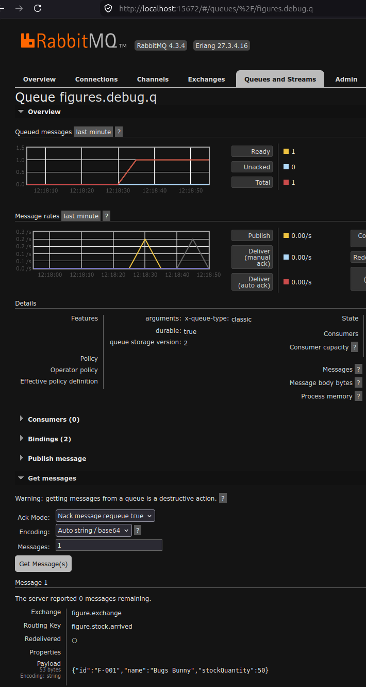

## Logları OpenObserve ile İzlemek

Uygulamayı buraya kadarki haliyle çalıştırdığımızda OpenObserve üzerinde bir log düşmediğini görürüz. Bunun için oluşan logları örneğin `fluent-bit` gibi bir enstrüman ile OpenObserve'a yönlendirmemiz gerekir. Ben docker kullandığım için gerekli ayarları yine docker-compose üzerinden yaptım ama ekstra bazı konfigurasyon işlemleri de gerekti. Önce docker-compose'un durumuna bakalım.

```yml
fluent-bit:
    image: fluent/fluent-bit:latest
    container_name: jakarta-fluent-bit
    volumes:
      - /home/buraks/payara-micro/logs:/var/log/payara:ro
      - ./fluent-bit.conf:/fluent-bit/etc/fluent-bit.conf:ro
      - ./parsers.conf:/fluent-bit/etc/parsers.conf:ro
    networks:
      - spring-network
```

Burada dikkat edilmesi gereken birkaç nokta var. Öncelikle `fluent-bit` container'ı için bir volume tanımladık. Bu volume, host makinedeki `/home/buraks/payara-micro/logs` dizinini container içindeki `/var/log/payara` dizinine bağlar. Bu sayede Payara Micro tarafından üretilen log dosyaları, Fluent Bit container'ı tarafından okunabilir hale gelir. Ayrıca `fluent-bit.conf` ve `parsers.conf` dosyalarını da container içine mount ettik. Bu dosyalar Fluent Bit'in nasıl çalışacağını ve logları nasıl parse edeceğini belirler. İçerikleri de şöyledir ve docker-compose ile aynı dizinde yer almaktadırlar.

`fluent-bit.conf` içeriği;

```conf
[SERVICE]
    Flush         1
    Log_Level     info
    Parsers_File  parsers.conf

[INPUT]
    Name              tail
    Path              /var/log/payara/server.log
    Tag               payara.*
    Parser            payara_json
    Refresh_Interval  5

[OUTPUT]
    Name          http
    Match         payara.*
    Host          openobserve
    Port          5080
    URI           /api/default/payara_logs/_json
    Format        json
    http_User     admin@example.com
    http_Passwd   ComplexPassword123!
    tls           off
```

Bu dosyadaki bölümlere bir değerlendirelim.

- `[SERVICE]` bölümü Fluent Bit servisinin genel ayarlarını içerir.
  - `Flush` parametresi logların ne sıklıkla işleneceğini belirler.
  - `Log_Level` parametresi loglama seviyesini belirler.
  - `Parsers_File` parametresi ise logların parse edilmesi için kullanılacak parser dosyasını belirtir.
- `[INPUT]` bölümü logların nereden alınacağını ve nasıl parse edileceğini belirler.
  - `Name` parametresi input plugin'ini belirtir. `tail` eklentisi log dosyasının sonuna eklenen yeni logları takip edeceğimizi ifade ediyor.
  - `Path` parametresi log dosyasının yolunu belirtir. Burada Payara Micro tarafından üretilen `server.log` dosyasını takip ediyoruz ki bunun içeriği de Java uygulamamızdan gelen logları içeriyor.
  - `Tag` parametresi loglara bir etiket ekler. Bu etiket, output bölümünde hangi logların işleneceğini belirlemek için kullanılır.
  - `Parser` parametresi logların parse edilmesi için kullanılacak parser'ı belirtir. Burada `payara_json` parser'ını kullanıyoruz.
  - `Refresh_Interval` parametresi log dosyasının ne sıklıkla kontrol edileceğini belirler.
- `[OUTPUT]` bölümü logların nereye gönderileceğini ve nasıl formatlanacağını belirler.
  - `Name` parametresi output plugin'ini belirtir. `http` eklentisi logları bir HTTP endpoint'ine göndereceğimizi ifade ediyor.
  - `Match` parametresi hangi logların bu output'a gönderileceğini belirler. Burada `payara.*` etiketi ile işaretlenmiş loglar gönderilecek.
  - `Host`, `Port`, `URI` parametreleri logların gönderileceği OpenObserve servisinin adresini ve endpoint'ini belirtir.
  - `Format` parametresi logların hangi formatta gönderileceğini belirtir. Burada JSON formatını kullanıyoruz.
  - `http_User`, `http_Passwd` parametreleri OpenObserve servisinin kimlik doğrulama bilgilerini içerir.
  - `tls` parametresi TLS kullanımını belirler. Burada TLS kapalı.

`parsers.conf` içeriği;

```conf
[PARSER]
    Name    payara_json
    Format  json
```

Tabii bu tamamen benim sistemime özel bir çözüm. Payara-micro sürümünü kullandığım için onunla ilgli de bir ayarlama yapmak gerekti. Bunun için payara-micro'nun kurulduğu klasöre birde `logging.properties` isimli aşağıdaki içeriğe sahip dosya eklendi.

```text
handlers=java.util.logging.FileHandler,java.util.logging.ConsoleHandler

java.util.logging.FileHandler.pattern=/home/buraks/payara-micro/logs/server.log
java.util.logging.FileHandler.formatter=fish.payara.enterprise.server.logging.JSONLogFormatter
java.util.logging.FileHandler.limit=10000000
java.util.logging.FileHandler.count=1
java.util.logging.FileHandler.append=true
java.util.logging.FileHandler.level=INFO

java.util.logging.ConsoleHandler.formatter=com.sun.enterprise.server.logging.ODLLogFormatter
java.util.logging.ConsoleHandler.level=FINE

.level=INFO
```

Aslında burada iki handler tanımı görüyoruz. Birisi `FileHandler` diğeri ise `ConsoleHandler`. ConsoleHandler, logları konsola yazdırır ve OpenObserve ile ilgisi yoktur. FileHandler ise logları `server.log` isimli dosyaya yazdıracak şekilde ayarlanmıştır ve OpenObserve ile ilgilidir. Dikkat çekici bir diğer nokta ise FileHandler formatter bileşeninin `fish.payara.enterprise.server.logging.JSONLogFormatter` olarak ayarlanmasıdır. Bu sayede loglar JSON formatında yazdırılır ve Fluent Bit tarafından parse edilebilir hale gelir.

Bu ayarlamalar sonrası yaptığım denemelerde logların OpenObserve üzerine aktığını gördüm. Lakin yine bir workaround gerekti. Payara-micro server'ı başlatırken aşağıdaki gibi açıkça hangi loglama özelliklerini kullanacağını belirtmek gerekiyor.

```bash
java -Djava.net.preferIPv4Stack=true -jar payara-micro-7.2026.5.jar \
  --deploy wars/inventory-events-service-1.0-SNAPSHOT.war \
  --logproperties /home/buraks/payara-micro/logging.properties
```

Sonrasında OpenObserve arabiriminde `payara_logs` isimli bir stream oluştuğunu ve içeriğine ulaşabildiğimi gördüm.

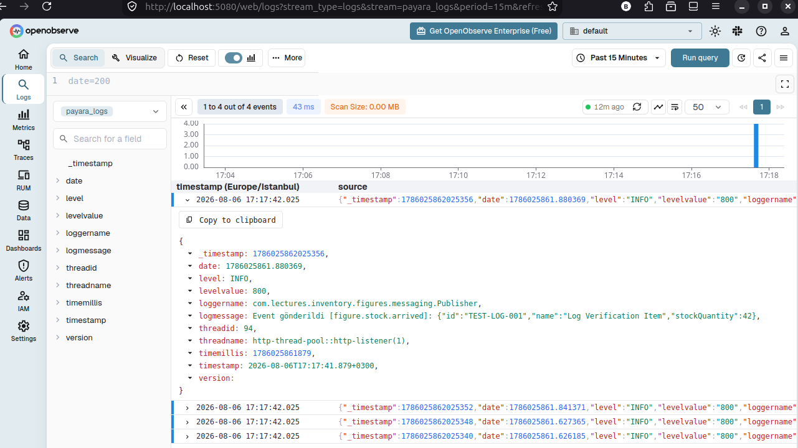

Ancak elbette bu kendi Ubuntu sistemimde kurguladığım çözüm. Bir Payara Server kurulduğunda buradaki ayarlar farklılık gösterebilir. Yine de işin teorisini kavramak önemli. Uygulama loglarını OpenObserve üzerinde görmek için Fluent Bit gibi bir log forwarder kullanmak gerekiyor. Fluent Bit, logları toplar, parse eder ve OpenObserve'a gönderir. Bu sayede uygulama loglarını merkezi bir şekilde izleyebiliriz.

## Inventory Notification Service

Bu uygulama Inventory Service tarafından fırlatılan event'lerin RabbitMQ üzerinden dinlenmesini sağlıyor. Bir nevi consumer rolünü üstlendiğini söyleyebiliriz. Yine benzer prensiplerle geliştirilen ama farklı olarak consumer rolünü üstlenen deneysel bir REST Api uygulaması söz konusu. Her zaman olduğu gibi bu uygulamayı çalıştırmak içinde `inventory-notification-service-1.0` dosyasını Payara Micro sunucusuna deploy etmemiz gerekiyor. Sonrasında Insomnia veya curl komutları ile test edebiliriz.

### Nasıl Test Edebiliriz?

Her iki uygulamayı da `payara-micro` sunucusunda deploy ederek çalıştırıyorum. Dolayısıyla port çakışması olası. Bu nedenle örnekleri başlatırken açıkça port belirtmek gerekiyor. Aşağıdaki terminal komutları ile ilerleyebiliriz.

```bash
# Inventory Service uygulamasını 8080 portu üzerinden çalıştırıyoruz.
java -Djava.net.preferIPv4Stack=true -jar payara-micro-7.2026.5.jar \
  --port 8080 \
  --nocluster \
  --deploy wars/inventory-events-service-1.0-SNAPSHOT.war \
  --logproperties /home/buraks/payara-micro/logging.properties

# Inventory Notification Service uygulamasını 8081 portu üzerinden çalıştırıyoruz.
java -Djava.net.preferIPv4Stack=true -jar payara-micro-7.2026.5.jar \
  --port 8081 \
  --nocluster \
  --deploy wars/inventory-notification-service-1.0.war \
  --logproperties /home/buraks/payara-micro/logging.properties
```

Notification Service uygulamasında bir health endpoint yer alıyor. Servisin ayakta olup olmadığını kontrol etmek için kullanabiliriz. Bu amaçla aşağıdaki curl komutunu çalıştırabiliriz.

```bash
curl http://localhost:8081/inventory-notification-service-1.0/api/health
```

Her şey yolunda ise Event servis tarafından bir Post mesajı gönderip logları takip edebiliriz. Fırlatılan olayın yakalanması ve buna karşılık bir log mesajının OpenObserve üzerinde gözlemlenmesi gerekiyor. Bu sayede iki process arasında event bazlı bir mesajlaşma olduğunu görebiliriz. Örneğin aşağıdaki curl komutu ile Inventory Service uygulamasına bir POST talebi gönderelim.

```bash
curl -X POST http://localhost:8080/inventory-events-service-1.0-SNAPSHOT/api/inventory/stock-arrival \
  -H "Content-Type: application/json" \
  -d '{"id":"1001","name":"Can Kulod Van Dam","stockQuantity":24}'
```

Terminalde olayların yakalandığına dair loglar görmeliyiz ancak OpenObserve üzerinden aynı sonuçları elde edemeyebiliriz. Hatırlarsanız bir önceki örnekte loglar için Fluent Bit tarafına properties dosyası eklemiştik. Her iki uygulama için de ayrı properties dosyaları hazırlayarak farklı log dosyalarına yazmalarını sağlayabilir ve OpenObserve üzerinde daha kolay gözlemleyebiliriz. Ben yine kendi ubuntu sistemimde kullandığım `payara-micro` server üzerinden ele alacağım.

Event oluşturan inventory servis logları için `logging-events.properties` isimli bir dosya oluşturdum. İçeriği şöyle;

```text
handlers=java.util.logging.FileHandler,java.util.logging.ConsoleHandler

java.util.logging.FileHandler.pattern=/home/buraks/payara-micro/logs/inventory-events-service.log
java.util.logging.FileHandler.formatter=fish.payara.enterprise.server.logging.JSONLogFormatter
java.util.logging.FileHandler.limit=10000000
java.util.logging.FileHandler.count=1
java.util.logging.FileHandler.append=true
java.util.logging.FileHandler.level=INFO

java.util.logging.ConsoleHandler.formatter=com.sun.enterprise.server.logging.ODLLogFormatter
java.util.logging.ConsoleHandler.level=FINE

.level=INFO
```

Benzer şekilde event'i yakalayan notification servis logları için de `logging-notification.properties` isimli bir dosya oluşturdum. İçeriği şöyle;

```text
handlers=java.util.logging.FileHandler,java.util.logging.ConsoleHandler

java.util.logging.FileHandler.pattern=/home/buraks/payara-micro/logs/inventory-notification-service.log
java.util.logging.FileHandler.formatter=fish.payara.enterprise.server.logging.JSONLogFormatter
java.util.logging.FileHandler.limit=10000000
java.util.logging.FileHandler.count=1
java.util.logging.FileHandler.append=true
java.util.logging.FileHandler.level=INFO

java.util.logging.ConsoleHandler.formatter=com.sun.enterprise.server.logging.ODLLogFormatter
java.util.logging.ConsoleHandler.level=FINE

.level=INFO
```

Bu ayarlamalara istinaden `fluent-bit.conf` dosyasında da tüm farklı input'ları ele almak için aşağıdaki değişikliği yaptım.

```text
[INPUT]
    Name              tail
    Path              /var/log/payara/*.log
    Path_Key          source_file
    Tag               payara.*
    Parser            payara_json
    Refresh_Interval  5
```

Sonrasında `fluent-bit` container'ını yeniden başlatmakta yarar var ki güncel konfigurasyon ayarlarını alsın. Ancak payara tarafındaki yürütmek komutlarımız da yeni log dosyalarına yazacak şekilde güncellenmeli. Bu sayede her iki uygulamanın logları da OpenObserve üzerinde gözlemlenebilir hale gelir.

```bash
# Önce fluent-bit container'ını yeniden başlatalım.
sudo docker restart jakarta-fluent-bit

# Inventory Service uygulamasını 8080 portu üzerinden çalıştırıyoruz.
java -Djava.net.preferIPv4Stack=true -jar payara-micro-7.2026.5.jar \
  --port 8080 --nocluster \
  --deploy wars/inventory-events-service-1.0-SNAPSHOT.war \
  --logproperties /home/buraks/payara-micro/logging-events.properties

# Inventory Notification Service uygulamasını 8081 portu üzerinden çalıştırıyoruz.
java -Djava.net.preferIPv4Stack=true -jar payara-micro-7.2026.5.jar \
  --port 8081 --nocluster \
  --deploy wars/inventory-notification-service-1.0.war \
  --logproperties /home/buraks/payara-micro/logging-notification.properties
```

İşte küçük bir ispat.

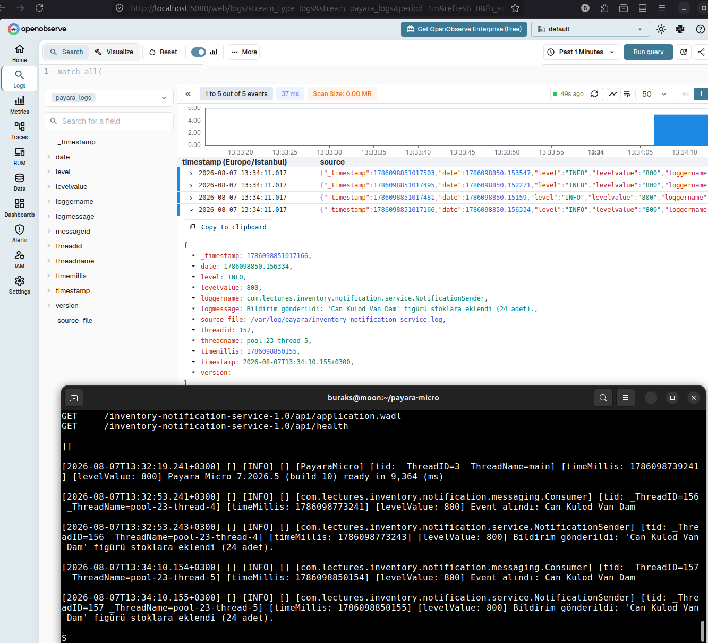

## Memo App

Yine Jakarta ile yazılmış olan ancak bu kez HTML ve Vanilla JavaScript ile geliştirilmiş bir web uygulaması. Bu uygulama daha önceden Rust ile yazmayı denediğim bir web uygulamasının benzeri. Gündelik olarak farklı kaynaklardan (dergiler, bültenler, kitaplar vb) defterlere aldığım notları bir web uygulaması üzerinden kayıt altına almayı hedefliyor. Backend taraf `todo-app` ile neredeyse aynı. Yani JAX-RS, CDI ve JPA kullanıyor. Frontend taraf ise HTML ve Vanilla JavaScript ile geliştirildi ve stiller için basit bootstrap kullanılıyor. Veriyi yine PostgreSQL veritabanında saklıyoruz. Dolayısıyla `docker-compose` dosyasında konuşlandırdığımız PostgreSQL container'ını ayağa kaldırmak gerekiyor.

Tabii memo tablosunun da oluşturulması da lazım. Bunun için `src/main/resources/META-INF/persistence.xml` dosyasında `jakarta.persistence.schema-generation.database.action` özelliğini **create** veya **drop-and-create** olarak ayarlayabiliriz. Bu sayede uygulama çalıştığında JPA, MemoConfiguration dosyasındaki DataSourceDefinition özelliğinde belirtilen konfigurasyon ayarlarına göre gerekli veritabanını ve tabloları otomatik olarak oluşturacaktır *(Bunu sadece geliştirme ortamında kullanılmalı. Üretim ortamında veritabanı ve tabloların manuel olarak oluşturulması veya migration araçları ile yönetilmesi daha güvenli olur)*

Son olarak `memo-app` isimli projeyi çalıştırmak için yine `payara-micro` sunucusuna deploy etmek gerekiyor.

```bash
# memo-app.war dosyasını oluşturmak için önce projeyi derleyelim.
mvn clean package

# Sonrasında Payara Micro sunucusuna deploy edelim.
java -Djava.net.preferIPv4Stack=true -jar payara-micro-7.2026.5.jar --deploy wars/memo-app-1.0.war
```

İşte çalışma zamanından birkaç görüntü;

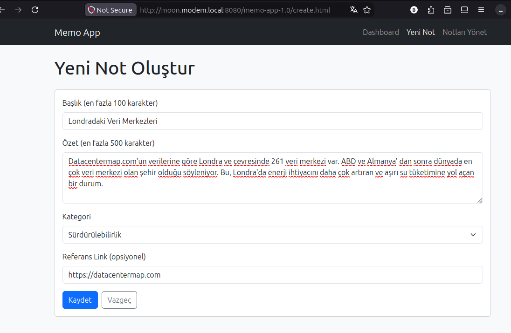

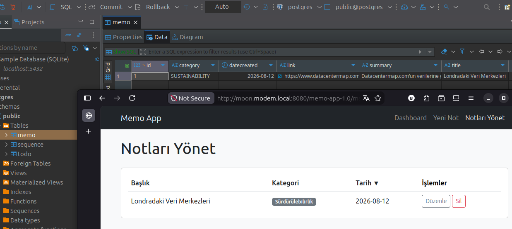

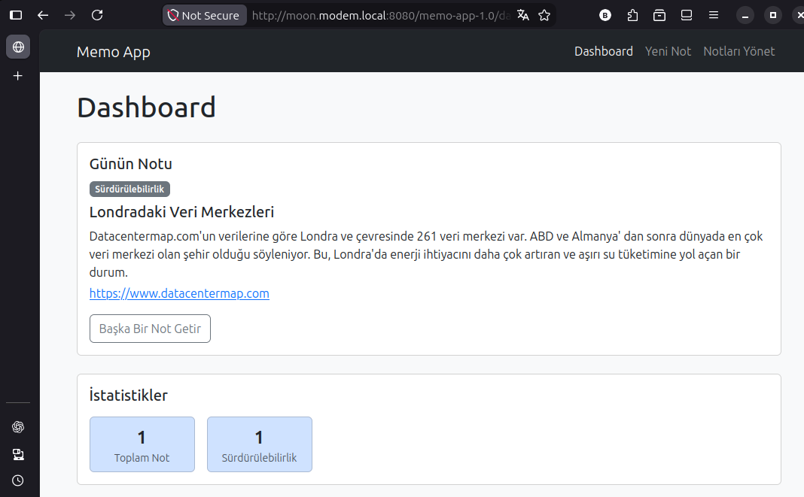

## GameCatalog Service Uygulaması

Bu örnekte monolitik mimarilerinin en bilinen ve en sık kullanılan örneklerinden birisi olan katmanlı mimari *(Layered Architecture)* ele alınıyor. Başlangıçta basit bir katman yapısı kullanıyoruz. Bir başka sürümünde CQRS *(Command Query Responsibility Segregation)* yaklaşımını da ele alabiliriz. Uygulamayı test etmek için her zaman olduğu gibi öncelikle build alınan WAR dosyasının Payara Micro sunucusuna deploy edilmesi gerekiyor. Sonrasında Insomnia veya curl komutları ile test edebiliriz.

```bash
# game-catalog-service.war dosyasını oluşturmak için önce projeyi derleyelim.
mvn clean package

# Sonrasında Payara Micro sunucusuna deploy edelim.
java -Djava.net.preferIPv4Stack=true -jar payara-micro-7.2026.5.jar --deploy wars/game-catalog-service.war --logproperties /home/buraks/payara-micro/logging.properties
```

Örnek bir POST çıktısı;

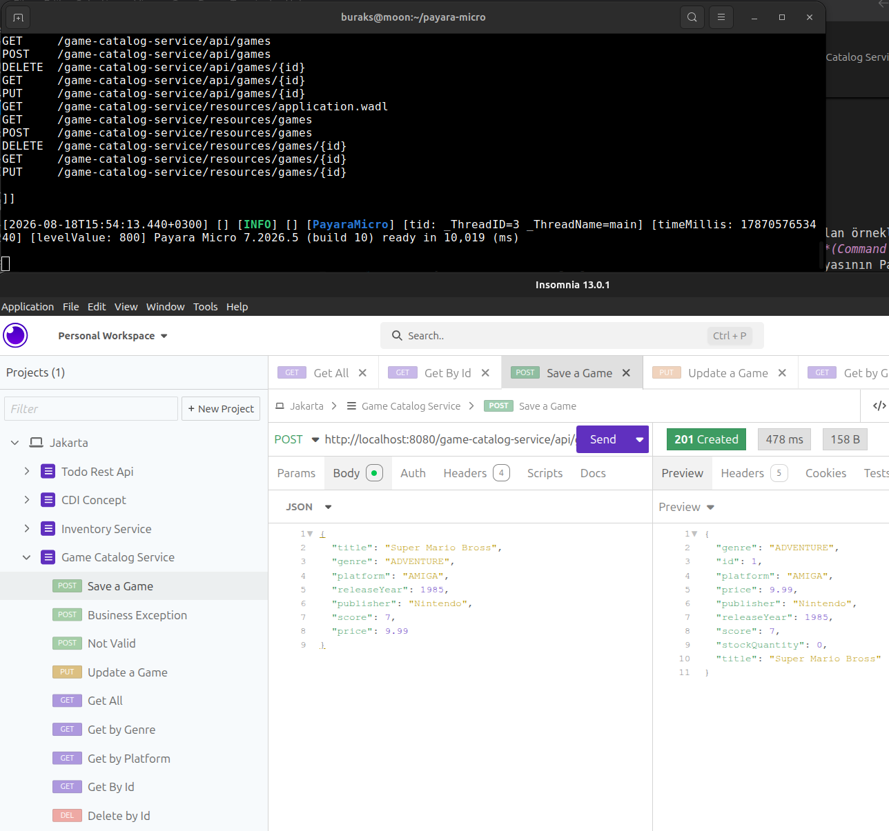

Diğer denemeler için [Insomnia_GameCatalogApi.yaml](./Insomnia_GameCatalogApi.yaml) dosyasını kullanabiliriz. Bu dosyayı Insomnia'ya import ederek testleri kolayca yapabiliriz.

### Repository Kullanımları

Bu örnekte ilk olarak In-Memory çalışan bir repository baz alındı; `InMemoryGameRepository.java` Sonrasında docker container olarak ayağa kaldırdığımız My SQL veritabanını ele alan bir repository'ye geçtik; `JpaGameRepository.java`. Aslında bu sınıf genel olarak bir Java Persistence API *(JPA)* implementasyonu. Bu sınıfın `@ApplicationScoped` anotasyonu ile işaretlenmiş olması, CDI tarafından uygulama seviyesinde bir kez oluşturulmasını sağlar. Bu sayede uygulama boyunca aynı instance kullanılabilir. Ayrıca JPA'nın EntityManager'ı da bu sınıf içerisinde yönetiliyor. EntityManager, JPA'nın veritabanı işlemlerini gerçekleştiren ana bileşenidir ve genellikle uygulama seviyesinde bir kez oluşturulur ve tüm repository'ler tarafından paylaşılır. Uygulamayı payara-micro sunucusunda ele aldığımız için o ortama da bazı konfigurasyon ayarlarını vermemiz gerekir. Bu amaçla `persistence.xml` ve `glassfish-resources.xml` dosyaları kullanılır. Bu dosyalar, JPA ve veritabanı bağlantı ayarlarını içerir. Örneğin `persistence.xml` dosyasında veritabanı bağlantı ayarları, JPA provider'ı ve entity sınıfları belirtilir. `glassfish-resources.xml` dosyasında ise veritabanı kaynakları ve JNDI isimleri tanımlanır. Bu sayede uygulama sunucusu, JPA ve veritabanı bağlantılarını yönetebilir.

### Migration ve Flyway Kullanımı

Öğrenme safhasında persistence kısmındaki aşağıdaki nitelik önemlidir.

```xml
<property name="jakarta.persistence.schema-generation.database.action"  value="drop-and-create"/>
```

`drop-and-create` değeri, uygulama başlatıldığında veritabanındaki mevcut tabloların silinip yeniden oluşturulmasını sağlar. Bu, geliştirme ve test aşamalarında kullanışlıdır çünkü veritabanı şemasını hızlı bir şekilde sıfırlayabiliriz. Ancak bir handikapı vardır veriler sıfırlanır. Bu yüzden klasik olarak bir migration düzeneği kurgulamak gerekiyor. Örneğin RedGate'in [Flyway](https://flywaydb.org/) veya [Liquibase](https://www.liquibase.org/) gibi araçlar kullanarak veritabanı şemasını yönetebiliriz.

Bir .Net geliştiricisi için Entity Framework tarafındaki gibi Code First yaklaşımları Java eko sisteminde göremeyebiliriz. Bu son derece doğaldır zira felsefi olarak migration dosyalarının elle yazılmış, gözden geçirilmiş SQL betikleri olması tercih edilir. Zira otomatik üretilen migration'lar semantik olarak belirsiz değişikliklerde(rename işlemi gibi) veri kaybına yol açabilir. Entity Framework tarafı da zaten bu riski taşır ama Java dünyasında bu riske karşı geçmişten beri gelen ve temkinli davranmayı merkeze alan bir gelenek olduğunu söylemek yanlış olmaz.

Flyway implementasyonunu kısaca özetleyelim;

- Öncelikle MySQL docker container'ı silip tekrar ayağa kaldırdık. Taze bir başlangıç için.
- Flyway ile ilgili bağımlılıkları `pom.xml` dosyasına ekledik.
- `src/main/resources/db/migration` dizini altında migration dosyalarını oluşturduk. Bu dizin, Flyway'in varsayılan olarak migration dosyalarını aradığı yer. Örnek olarak **games** tablosunun oluşturulması ve örnek bir alanın eklenmesi işlemlerini sırasıyla `V1__create_games_table.sql` ve `V2__add_summary_column.sql` dosyalarında gerçekleştirdik. Dosya isimlendirmesi Flyway tarafından belirlenen bir konvansiyona uygun olmalı. Örneğin `V1__create_games_table.sql` dosyası, ilk migration'ı temsil eder ve `games` tablosunun oluşturulmasını sağlar. `V2__add_summary_column.sql` dosyası ise ikinci migration'ı temsil eder ve `games` tablosuna `summary` isimli yeni bir sütun ekler.
- Pek tabii **summary* alanının Game entity sınıfına da eklenmesi gerekir.
- Migration işlemlerini uygulama başlarken otomatik olarak gerçekleştirmek ya da varsa yeni versiyonları işlettirmek adına işleri kolaylaştıracak bir bileşen yazdık; `FlywayMigrationRunner.java`.

Bu işlemler sonrasında uygulama tekrardan çalıştırılabilir. İlk çalıştırma esnasında `payara-micro` tarafındaki sunucu loglarında Flyway tarafından migration işlemlerinin başarıyla tamamlandığını görmemiz gerekiz.

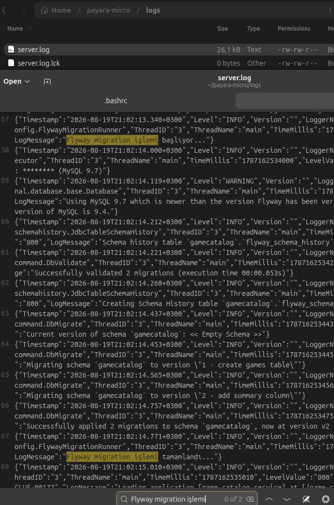

Hatta docker container içerisine mysql terminali açıp migration tarihçesini ve tablomuzun güncel halini de görebiliriz.

```bash
docker exec -it jakarta-mysql mysql -u gamecatalog_user -p gamecatalog \
  -e "SELECT version, description, success FROM flyway_schema_history; DESCRIBE games;"
```

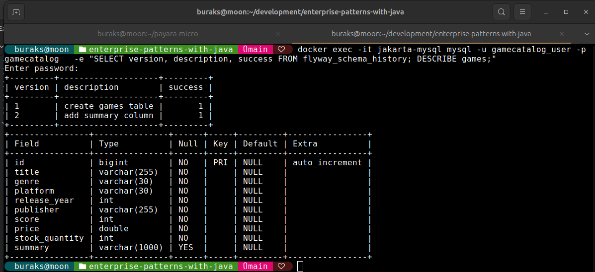

Artık yeni bir tablo ekleme, kolon değişikliği yapma gibi işlemlere ihtiyaç duyduğumuzda yeni versiyon dosyaları oluşturmamız ve Entity sınıflarında gerekli değişiklikleri yapmamız yeterli olacaktır. Flyway, uygulama başlatıldığında mevcut versiyonları kontrol eder ve eksik olan migration'ları uygular. Bu sayede veritabanı şeması her zaman güncel kalır. Yapılmaması gereken şeylerin başında var olan versiyonlar üzerinde değişiklik yapmak gelir. Bu, migration tarihçesini bozabilir ve veri kaybına yol açabilir. Bu yüzden her zaman yeni bir versiyon dosyası oluşturmak en güvenli yaklaşımdır.

## Transaction Kullanım Örneği (event-ticketing-service Uygulaması)

Bu örnekte amaç bir bilet rezervasyon işlemini transaction bütünlüğü içerisinde ele almaktır. Örnekte PostgreSQL veritabanı kullanılmakta ve her zaman olduğu gibi docker container olarak ayağa kaldırılmakta. Örnek veritabanımızda etkinlik *(events)*, müşteri *(customers)* ve rezervasyon *(bookings)* tabloları yer almakta. Ayrıca başarılı/başarısız transaction'lar dahil tüm işlemleri kayıt altına aldığımız bir tablo daha bulunuyor *(booking_attempts)*. Veritabanı tablolarının oluşturmak için kullanacağımız script dosyası da [burada](./sql/eventTicketing.sql) yer almakta.

Uygulamayı ayağa kaldırmak için diğer örneklerde de olduğu gibi önce `event-ticketing-service.war` dosyasını Payara Micro sunucusuna deploy etmemiz gerekiyor. Sonrasında Insomnia veya curl komutları ile test edebiliriz.

```bash
# event-ticketing-service.war dosyasını oluşturmak için önce projeyi derleyelim
mvn clean package

# Sonrasında Payara Micro sunucusuna deploy edelim.
java -Djava.net.preferIPv4Stack=true -jar payara-micro-7.2026.5.jar --deploy wars/event-ticketing-service.war --logproperties /home/buraks/payara-micro/logging.properties
```

Bu örnekte transaction yönetimini test etmek için farklı senaryolar ele alabiliriz. Bakiyenin yetersiz olması hali bunun en popülerlerinden birisi olacaktır. Aşağıdaki **curl** komutları ile ve **Insomnia** üzerinden test edebiliriz.

```bash
# Veritabanı scriptini çalıştırdıysak önceden eklenmiş müşteri ve etkinlik verileri olmalı
# Bunları aşağıdaki curl komutları ile test edebiliriz.

curl http://localhost:8080/event-ticketing-service/api/events/1 -w "\\n"
curl http://localhost:8080/event-ticketing-service/api/customers/1 -w "\\n"
```

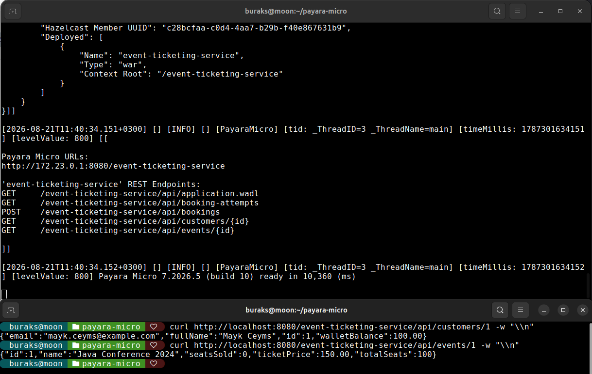

```bash
# Başarılı olacak bir rezervasyon deneyelim(Müşteri bakiyesi yeterli)
# Deneme öncesinde ve sonrasında koltuk sayısını da kontrol etmek lazım.
# İşlem başarılı olursa rezerver edilen koltuk sayısı artmalı ve müşteri bakiyesi düşmelidir.
curl http://localhost:8080/event-ticketing-service/api/events/2 -w "\\n"
curl http://localhost:8080/event-ticketing-service/api/customers/3 -w "\\n"
curl -X POST http://localhost:8080/event-ticketing-service/api/bookings \
  -H "Content-Type: application/json" \
  -d '{"eventId":2,"customerId":3,"seatCount":1}'
curl http://localhost:8080/event-ticketing-service/api/events/2 -w "\\n"
curl http://localhost:8080/event-ticketing-service/api/customers/3 -w "\\n"
```

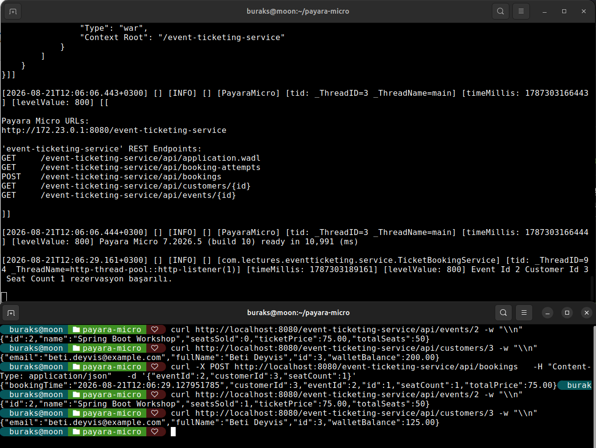

```bash
# Yetersiz bakiye ile başarısız olacak bir rezervasyon deneyelim(Bilet sayısını abartarak)
# Bu işlem öncesinde ve sonrasında koltuk sayısını bir kontrol etmek gerekir.
# Transaction'ın geri alındığının kanıtı olarak koltuk sayısının değişmediğini görmeliyiz.
# Pek tabii müşteri bakiyesi de değişmemelidir.
curl http://localhost:8080/event-ticketing-service/api/events/2 -w "\\n"
curl http://localhost:8080/event-ticketing-service/api/customers/1 -w "\\n"
curl -X POST http://localhost:8080/event-ticketing-service/api/bookings \
  -H "Content-Type: application/json" \
  -d '{"eventId":2,"customerId":1,"seatCount":10}'
curl http://localhost:8080/event-ticketing-service/api/events/2 -w "\\n"
curl http://localhost:8080/event-ticketing-service/api/customers/1 -w "\\n"
```

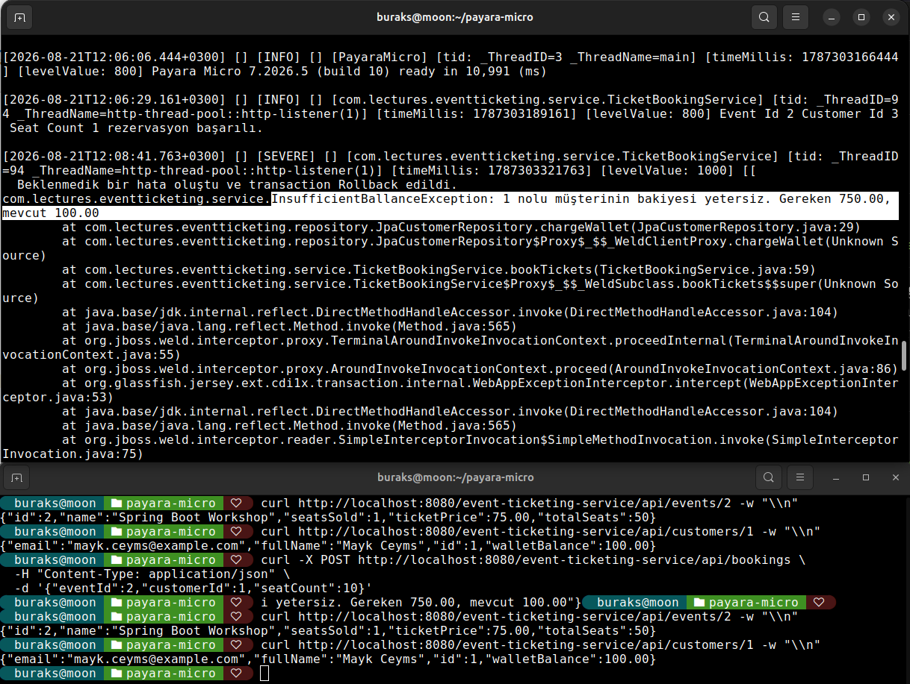

```bash
# Tüm denemelerde booking-attempts tablosuna kayıt düşüldüğünü görebiliriz. Bu tabloya bakmak için aşağıdaki curl komutunu çalıştırabiliriz.
curl http://localhost:8080/event-ticketing-service/api/booking-attempts -w "\\n"
```

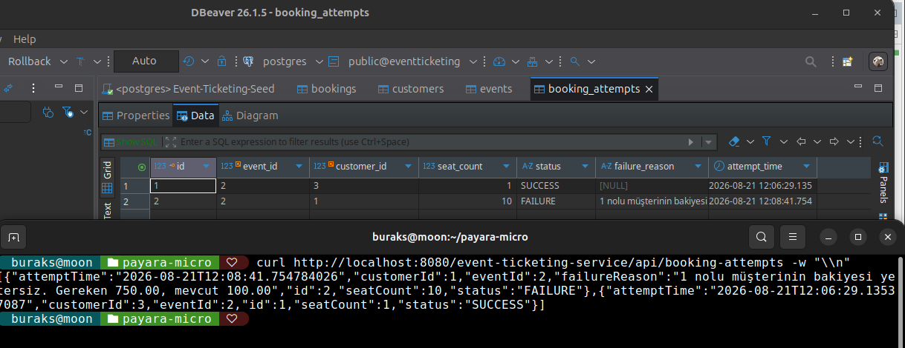

### Kapsam Dışı Bilgi

Son curl komutu ile elde ettiğimiz JSON çıktısı rahat okunmuyor. **Linux** tarafında bu çıktıyı **jq** isimli bir araca devredebiliriz. Bu araç JSON çıktısını daha okunabilir bir şekilde formatlar.

```bash
# Önce kurulum
sudo apt update && sudo apt install jq

# Yeni çağrım şekli
curl http://localhost:8080/event-ticketing-service/api/booking-attempts | jq
```

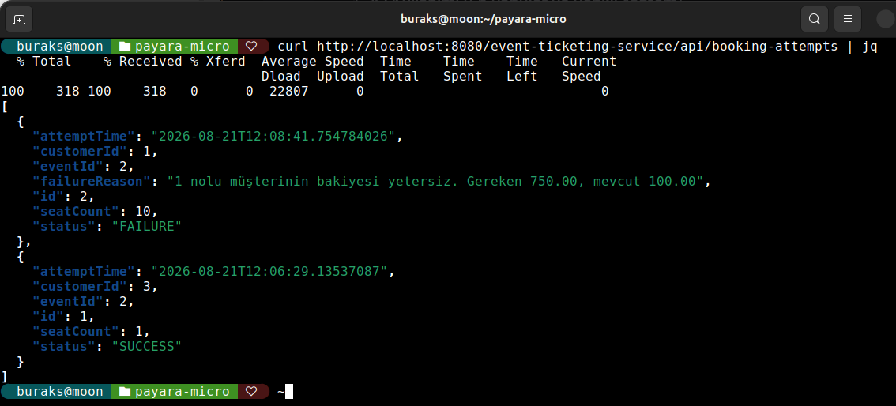

## FAQ

- **Java EE denince aklımıza ne gelmeli?** Kurumsal çözümler geliştirmek için kullanılan bir özet spesifikasyonlar *(Abstract Specifications)* ve standartlar koleksiyonu.
- **Neden Jakarta EE diye de bir şey var?** Oracle'ın Java EE'yi Eclipse Foundation'a devretmesiyle birlikte, Java EE artık Jakarta EE olarak adlandırılmaktadır. Jakarta EE, Java EE'ın tüm özelliklerini ve API'lerini içerir, ancak isimlendirme ve bazı paket değişiklikleri ile güncellenmiştir.
- **Peki ya Jakarta EE ile Spring Framework arasındaki farklar nelerdir?** Java EE, Spring Framework'ten etkilenmiştir ve Spring boot'ta Java EE'den etkilenmiştir. Her ikisi de iyi platformlardır ve bir karşılaştırma yapmak gereksizdir.
- **JSR Kıslatmasını görünce ne anlamalıyız?** Java topluluğu tarafından önerilen ve Java platformuna eklenmesi düşünülen yeni özellikleri veya mevcut özelliklerde yapılacak değişiklikleri tanımlayan bir belge. Her JSR, belirli bir Java teknolojisi veya API için bir spesifikasyon sunar ve bu spesifikasyonlar, uygulama sunucuları tarafından implemente edilir. Örneğin [CDI 1.0 için JSR-299](https://jcp.org/ja/jsr/detail?id=299), [JPA 2.0 için JSR-317](https://jcp.org/ja/jsr/detail?id=317) gibi
